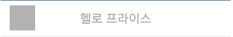
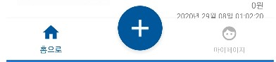
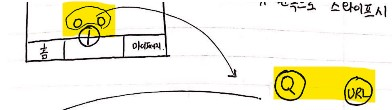
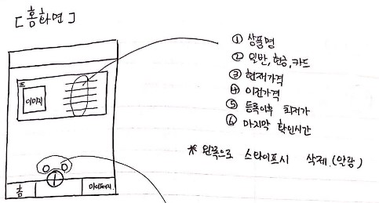
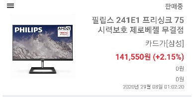
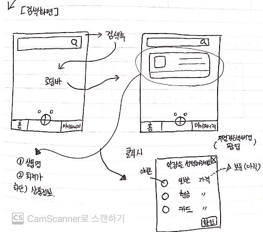
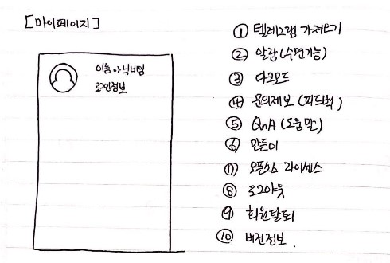
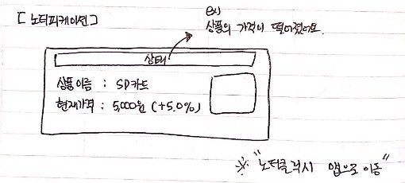

## 헬로프라이스

다나와 데이터를 기반으로,
사용자가 등록한 상품의 최저가격이 떨어질 경우, 알림을 제공해주는 서비스

현재 : 텔래그램 챗봇
계획 : 앱으로 출시 후, 텔레그램 챗봇 서비스 마이그레이션 예정.

- v1.0 릴리즈 - 개인용
- [v2.0 릴리즈](https://www.clien.net/service/board/lecture/14286975)
- [v3.0 릴리즈](https://www.clien.net/service/board/lecture/15092094)
- [텔레그램 챗봇](https://t.me/helloprice_bot)
 

## 공유

- 최초 20년 1월 배포 후, 8개월 서비스 유지
- 누적사용자 3,000명 + @
- 서비스 특성 상 트래픽이 많지 않지만, 꾸준하게 사용하는 사용자가 많음

#### 다나와 이해하기
- 가격비교 중지, 품절, 단종, 판매중 상품상태를 가집니다.
- 다나와는 결제 타입에 3가지를 가집니다.
	- 현금 결제 최저가 - 현금으로 결제 시 최저가
	- 카드 결제 최저가 - 지정 카드로 결제 시 최저가 (카드사 이벤트, 청구할인 등)
	- 일반 결제 - 현금, 카드 제외한 결제 타입 최저가

#### Admin 개발
- 공지사항 전송 진행중

#### 서버 개발
- 텔레그램 챗봇
    - 서비스 중
- 앱
    - 개발 진행 중
    - 클라이언트 API 개발 (조회, 상품등록)
    
### IOS 개발
- UI 구현중..?

### 안드로이드 개발
- API 연동 완료
- UI 구현중

### 웹 개발
- 진행중 

 

## 팀원

- 서버 : 포도, 에디
- IOS : 매튜
- 안드로이드 : 헤더
- 디자인 : 나나

감사합니다..!

 

## 포도, 매튜, 헤더의 기획

### 관리자 페이지 기능 명세
- 사용자에게 공지사항을 전송합니다.
- 공지사항 로그를 확인합니다.

### 클라이언트 기능 명세

*기본적으로 현재 서비스 중인 텔래그램 챗봇 기능을 마이그레이션 하기 때문에, 
혼동되는 부분을 챗봇을 보시면 더 이해 잘되실거에요!*

- 아이폰, 안드로이드, 웹 3가지 플랫폼을 지원합니다
	- 아이폰, 안드로이드는 PUSH로 알림을 제공 받습니다.
	- 웹의 경우 브라우저 알림을 통해 PC에서 알림을 제공 받습니다.
- 사용자는 소셜로그인을 통해 회원가입 및 로그인을 진행합니다.
	- 회원가입은 따로 존재하지 않으며, 최초 로그인시 회원가입이 자동 진행됩니다.
	- 각 소셜로그인은 별도의 계정입니다.
	- 소셜로그인은 구글, 애플, 카카오 3가지 입니다.
	- 소셜로그인으로 부터 프로필, 이름 정보를 가져오며, 그 외 정보는 폐기합니다.
- 사용자는 상품을 검색하여 알림을 등록합니다.
- 사용자는 상품의 URL을 이용하여 알림을 등록합니다.
- 사용자는 각 상품에 대해서 현금, 카드, 일반 세가지 타입중 복수 선택하여 알림을 등록합니다.
-  상태 변동 시, 최저가 하락 시, 사용자에게 알림을 제공합니다.
	- 상품 상태는 가격 비교 중지, 단종, 품절, 알 수 없음, 판매중으로 구분됩니다.
	- 판매중 -> 다른 상태 변동 시 알림을 제공합니다.
	- 품절 - > 판매중 상태 변동 시 알림을 제공합니다.
	- 판매중 상태에서 최저가 1% 하락시 알림을 제공합니다.
- 상태가 가격비교 중지, 단종, 알수 없음 시 사용자 알림 설정이 자동으로 삭제됩니다.
- 사용자는 등록한 상품 알림에 대하여, 플랫폼을 통해 정보를 확인 할 수있습니다.
	- 상품명
	- 상품 결제 타입(일반, 현금, 카드)
	- 상품 이미지
	- 현재가격 ( 품절 일시, 0 원)
	- 가격 변동률
	- 가격 확인 일자
	- 등록시점 가격
	- 등록 후 최저가격

- 마이페이지에서 텔레그램 가져오기 기능을 통해, 사용자에게 데이터 마이그레이션을 제공합니다.
	- 텔레그램 ID를 입력하여, 데이터 마이그레이션

### 클라이언트 기능 명세 + @
- 2차 과제
	- 문의 제보 기능
		- 관리자페이지에서 수신 확인 및 응답
	- 사용자가 마이페이지에서 자신이 가진 카드사를 지정하여, 해당 카드 최저가 변경시만 알림 제공
		- 구현 이슈..
	- 마이페이지 수면 모드 설정
		- 각 사용자가 지정한 시간에 알림 제공 X
		- 지정 시간 종료 후 일괄 알림
	- 각 알림 별 하락율 설정
		- 사용자 상품 알림 등록 시, 지정가 또는 % 지정하도록 커스터 마이징 제공

- 아이디어
	- 다크모드 제공 
	- 하나의 메뉴로써 금일의 최저가격 하락율을 기반으로 랭킹 데이터 제공
	- 하나의 메뉴로써 뽐뿌, 알구게 같은 특가 공유사이트를 크롤링 하여 실시간 제공 
	- 하나의 메뉴로써 전체 채팅방을 제공하여, 사용자들간의 정보 공유

###  화면

**로그인**  
- 디자인 미정 
- 안드로이드 : 구글, 카카오 소셜로그인 제공
- 아이폰 : 구글, 카카오, 애플 소셜로그인 제공

 

**상단바**  

- 왼쪽 - 헬로프라이스 로고
- 중앙 - 메뉴명
- 오른쪽 - Blank

 

**하단바**  
  

- 메뉴 탭은 짝수 개수 유지 예정
- 중앙 - 상품 추가하기 큰 버튼
	- 클릭 시 애니메이션 제공하여, 검색, URL 두가지 버튼 (두번째 이미지 참조)

 

**홈화면**  

  

- 홈화면 - 등록 상품을 리스트 형식으로 제공합니다
	- 하나의 상품에 대해 여러 결제 알림이 등록되어있을 경우 별개로 취급합니다.
	- 따라서 상품이 중복 노출 되는 경우도 발생합니다.
	- 예)
	- 아이패드 - 현금최저가
	- 아이패드 - 카드최저가
	- 아이패드 - 일반최저가
	- 리스트 순서는 기본적으로 최근 등록 순 이며, 드래그를 통해 순서를 바꿀 수 있습니다.
	- 왼쪽 스와이프를 통해 알림을 삭제 할 수 있으며,  Alert를 제공하여 확인 받습니다.
- 홈화면 아이템
	- 2번 이미지 참조
	- 단순 구조입니다. 디자인 미정

 

**상품 검색**  

	
- 상품 검색 버튼 클릭시 노출되는 뷰입니다
- 상품명을 검색하면, 로딩바 진행 후 하단에 검색된 상품 리스트가 노출됩니다.
	- 상품명, 상품이미지, 현재최저가격(일반) 이 노출 됩니다.
- 리스트 아이템 클릭 시, 뷰 변화없이 작은창 생성 후, 백그라운드 검은투명창 생성 
	- 이미지 오른쪽 하단 참조
- 최저가 결제 알림 타입 복수 선택 후 확인 버튼을 통해 알림 등록

 

**상품 URL 추가**  

- 화면 미정
- 상품 검색과 확실히 구분하여, 클라이언트에게 혼동없는 뷰 제공!

 

**마이페이지(환경설정?)**  

- 이미지 참조 

 

**PUSH 알림**  

- 이미지 참조
